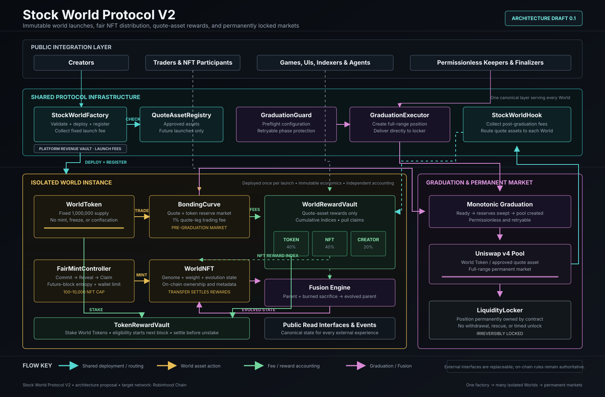

# Stock World Protocol V2 Architecture

Version: Draft 0.1

Status: Architecture proposal, not deployed production contracts

Network target: Robinhood Chain

## 1. Purpose

Stock World Protocol V2 extends the V1 world-launching model into a complete on-chain economy. Each World combines a fixed-supply fungible token, a fair NFT collection, an evolving NFT weight system, a quote-asset market, transparent fee distribution, and permanently locked post-graduation liquidity.

The protocol separates immutable World rules from replaceable interfaces. Websites, games, dashboards, indexers, and AI agents can read the same contracts without becoming part of the trust path.

Stock World is an experimental protocol name. A World Token or World NFT does not represent company equity, legal shares, voting rights, guaranteed income, or ownership of the issuer represented by a paired asset.

## 2. Design Goals

- Launch a World Token and World NFT economy in one deterministic flow.
- Give participants separate liquid-token and scarce-NFT entry paths.
- Distribute real quote-asset fees without inflationary reward emissions.
- Prevent new participants from claiming rewards generated before eligibility.
- Keep launched World economics immutable.
- Make graduation retryable and prevent stranded reserves.
- Permanently lock graduated liquidity with no withdrawal path.
- Avoid loops over token holders or NFTs during fee distribution.
- Expose complete on-chain state through stable public interfaces and events.
- Keep platform governance unable to alter an already launched World.

## 3. System Topology



```text
                         StockWorldFactory
                                |
               +----------------+----------------+
               |                                 |
       Shared Infrastructure              Per-World Contracts
               |                                 |
       QuoteAssetRegistry                  WorldToken
       StockWorldHook                      BondingCurve
       GraduationGuard                    WorldNFT
       GraduationExecutor                 WorldRewardVault
       LiquidityLocker                    FairMintController
       PlatformRevenueVault
```

Shared contracts serve every World. Per-World contracts isolate balances, accounting, parameters, and failure domains between launches.

## 4. Immutable Launch Configuration

```solidity
struct WorldConfig {
    string name;
    string symbol;
    address quoteAsset;
    address creator;
    uint256 graduationTarget;
    uint32 nftMaxSupply;
    uint16 tokenHolderBps;
    uint16 nftHolderBps;
    uint16 creatorBps;
}
```

Initial protocol constraints:

- World Token supply: `1,000,000` fixed units.
- World NFT maximum supply: `100` to `10,000`.
- NFT wallet allocation limit: `2` by default.
- Base trading fee: `1%` of the quote leg.
- Default fee allocation: `40%` Token / `40%` NFT / `20%` Creator.
- Creator allocation cap: `30%`.
- Allocation invariant: all World fee shares total exactly `10,000` basis points.
- Platform launch fee: `0.0003 ETH`, with gas paid separately.
- Quote asset, graduation target, fee allocation, and supply rules become immutable at launch.

## 5. Shared Contracts

### 5.1 StockWorldFactory

The factory validates configuration, collects the fixed launch fee, deploys the per-World stack, records canonical addresses, and coordinates graduation. It is the registry entry point for indexers and interfaces.

The factory may publish new templates for future Worlds, but it cannot alter existing deployments. Protocol revisions use a new factory instead of upgrading launched Worlds.

### 5.2 QuoteAssetRegistry

The registry contains canonical quote assets approved for new launches. An approved asset must have known decimals and standard ERC-20 transfer behavior. Fee-on-transfer, rebasing, callback-driven, blocklisted, or otherwise incompatible assets must be rejected.

Registry changes affect only future launches. A time-locked multisignature may maintain the registry until a credible permissionless policy is available.

### 5.3 StockWorldHook

The singleton Uniswap v4 hook collects the post-graduation fee only in the World's quote asset. A combined `beforeSwap` and `afterSwap` delta design covers quote-specified and quote-unspecified swaps, so the hook never accumulates World Token inventory and never needs a price oracle, privileged conversion operator, or manipulable internal swap. Anyone may sweep the exactly tracked quote balance into that World's reward vault.

The hook accepts registrations only from the immutable graduation coordinator and verifies the coordinator's canonical factory and World record. Its `beforeInitialize` callback accepts only that coordinator, preventing an unrelated account from pre-initializing a canonical pool. Its address must encode the required Uniswap v4 hook permission bits and must be deployed through a reproducible CREATE2 process.

### 5.4 GraduationGuard and GraduationExecutor

The guard preflights pool creation using the actual launch configuration and current quote-asset state. The executor creates the full-range Uniswap v4 position, sends it directly to the locker, and returns harmless dust according to fixed rules.

Graduation uses explicit phases and remains permissionless and retryable. A failed pool-creation transaction must not make collected reserves unreachable.

### 5.5 LiquidityLocker

The locker permanently owns each graduated position. It exposes no withdrawal, rescue, arbitrary-call, approval, or timed-unlock path. Neither the creator, platform, nor registry administrator can recover the position.

### 5.6 PlatformRevenueVault

The platform vault receives fixed launch fees. A future ENDSZ buyback module may spend a disclosed portion through a permissionless, TWAP-protected execution function. The initial release must not promise a buyback percentage until that percentage, venue, slippage policy, and destination are frozen in code.

## 6. Per-World Contracts

### 6.1 WorldToken

WorldToken is a standard fixed-supply ERC-20. It has no post-launch minting, freezing, blacklisting, confiscation, or administrator transfer function. The entire market allocation is delivered to the bonding curve at creation.

The curve, pool, locker, burn address, reward vault, and protocol-owned addresses are excluded from participant reward weight.

### 6.2 BondingCurve

The curve provides pre-graduation buying and selling against the selected quote asset. A constant-product model with a virtual quote reserve establishes the opening price:

```text
quoteReserve * tokenReserve = k
```

The curve reserves the World Token allocation required for graduation, applies deadline and minimum-output protection, collects the 1% quote-leg fee, and deposits fees into the WorldRewardVault. It closes permanently when graduation begins.

### 6.3 WorldNFT

WorldNFT is an ERC-721 collection with immutable supply rules and mutable on-chain evolution state:

```solidity
struct WorldBeing {
    uint128 weight;
    uint64 fusionCount;
    uint256 rewardDebt;
    bytes32 genome;
}
```

The contract exposes ownership, weight, fusion count, genome, metadata, and standard transfer interfaces. Every transfer settles the sender's accrued NFT rewards before ownership changes. The recipient becomes eligible only from the current reward index.

### 6.4 FairMintController

NFT distribution follows repeating Commit, Reveal, and Claim phases. Commitments hide participant secrets during entry. A permissionless finalization transaction combines revealed entropy with a future block value and records the epoch seed before the blockhash expires.

Each revealer receives a sequential index. Finalization derives a random starting index and selects one circular interval containing exactly the smaller of the epoch capacity, revealed count, and globally unreserved supply. Winner status is therefore independent of claim order and requires no loop over participants.

Finalized winners reserve supply only for the immutable claim window. Anyone may expire an unclaimed epoch afterward, returning unused reservations to later epochs. The controller enforces the historical wallet allocation limit, rejects duplicate commitments, naturally expires unrevealed entries, and never restores mint capacity when an NFT is later burned in Fusion.

If no one finalizes within the 256-block blockhash window, the epoch remains live through a visibly flagged late-entropy fallback based on the reveal aggregate and later chain entropy. This fallback protects permanent liveness but provides weaker unpredictability than on-time finalization. Neither path should be described as cryptographic or gambling-grade randomness, and block producers retain limited influence over public chain entropy.

### 6.5 WorldRewardVault

The reward vault receives quote assets from both the curve and the graduated pool. Each deposit is divided according to the immutable World configuration:

```text
World fee
  |-- Token reward allocation
  |-- NFT reward allocation
  `-- Creator claimable balance
```

Distribution uses cumulative indices rather than holder iteration:

```text
tokenRewardPerShare += tokenFee * 1e27 / eligibleTokenWeight
nftRewardPerWeight  += nftFee   * 1e27 / totalNFTWeight
```

Claims use a pull model. External transfers occur only after accounting state is updated and are protected against reentrancy.

## 7. Token Reward Eligibility

The recommended first release uses a TokenRewardVault rather than automatic wallet-balance rewards. Users stake World Tokens to receive future quote-asset fees. Stake activation begins in the next block, preventing same-block deposit-and-claim strategies. Unstaking settles rewards before principal is returned.

This design avoids adding reward accounting to every ERC-20 transfer and reduces temporary-balance and flash-liquidity attacks. Staking never mints additional World Tokens.

## 8. NFT Reward Accounting

NFTs receive rewards according to their active weight. A newly minted NFT records the current `nftRewardPerWeight` and cannot claim historical fees. Before transfer, burn, or Fusion, the contract settles all rewards earned under the previous owner and weight.

After transfer, future rewards follow the NFT. Previously accrued rewards remain claimable by the previous owner.

## 9. Fusion

Fusion uses a parent-and-sacrifice model:

```text
Parent NFT + Sacrifice NFT -> Evolved Parent NFT
```

Both NFTs must be owned or approved by the caller. The protocol settles both reward positions, burns the sacrifice, increases the parent's weight, updates its genome and fusion count, and sets its reward debt to the current index.

The initial weight rule is:

```text
newWeight = parentWeight + sacrificeWeight + 1
```

Thus `1 + 1` becomes `3`. Fusion processes one pair per transaction and does not provide a batch path.

## 10. Zero-NFT Reserve

If trading begins before any World NFT exists, the NFT fee allocation enters a visible zero-NFT reserve. It is never creator or platform revenue.

Before the first mint, anyone may permanently commit the reserve to the World's locked-liquidity allocation. If the first NFT is minted while the reserve is nonzero, the mint transaction commits it automatically. The first NFT participates only in fees deposited after its reward-index checkpoint.

After graduation, committed quote reserves remain attributed to their originating World in the immutable graduation coordinator. They must not be converted against the same pool using a caller-selected minimum output or a same-block spot price: that would make a permissionless maintenance call sandwichable. A future liquidity-addition path must provide either independently sourced paired World Tokens or a manipulation-resistant price mechanism. Until then, the reserve remains conserved and no account can withdraw it.

## 11. Fee Flow

Before graduation:

```text
Trader -> BondingCurve -> WorldRewardVault -> Token / NFT / Creator ledgers
```

After graduation:

```text
Trader -> Uniswap v4 Pool -> StockWorldHook
       -> exact quote-asset fee accounting
       -> permissionless sweep
       -> WorldRewardVault -> Token / NFT / Creator ledgers
```

Rewards and creator payouts are always denominated in the World's selected quote asset. No oracle is required for curve pricing or fee settlement.

## 12. World Lifecycle

```text
CONFIGURED
    -> CURVE_LIVE
    -> GRADUATION_READY
    -> RESERVES_SWEPT
    -> V4_POOL_CREATED
    -> PERMANENT_MARKET
```

Each phase transition is monotonic. Trading routes must read the authoritative phase instead of inferring it from balances. Recovery from a failed graduation attempt may retry the same transition but cannot return the World to curve trading.

## 13. Permission Model

After launch, no privileged account may:

- Increase World Token or NFT maximum supply.
- Change the quote asset or graduation target.
- Change the fee rate or allocation.
- Withdraw liquidity or zero-NFT reserves.
- Rewrite curve pricing.
- Freeze transfers or confiscate participant assets.
- Grant historical rewards to a new participant.
- Replace the World's contracts.

The creator may update only non-economic metadata and the address receiving future creator rewards, if those capabilities are explicitly enabled at launch.

## 14. Required Events and Read Interfaces

Core events include `WorldCreated`, `CurveTrade`, `FeeDeposited`, `RewardClaimed`, `MintCommitted`, `MintRevealed`, `NFTClaimed`, `Fused`, `GraduationStarted`, `PoolCreated`, `LiquidityLocked`, and `ZeroNftReserveCommitted`.

Public views must expose World configuration, lifecycle phase, canonical contract addresses, curve reserves, sellable supply, graduation progress, pool identity, fee indices, total NFT weight, zero-NFT reserve, and claimable balances.

These interfaces are the integration surface for independent UIs, games, analytics systems, and agents.

## 15. Security Invariants

- World Token total supply never exceeds the launch constant.
- Minted NFT count never exceeds the configured cap.
- Finalized NFT reservations plus historical mints never exceed the configured cap.
- Exactly the configured number of eligible winner indices is selected when sufficient revealers and supply exist.
- Claim order cannot turn a non-winning reveal into a winning reveal.
- Fusion never increases NFT count.
- A burned NFT can never become active again.
- Fee allocations always equal the assets received, excluding bounded rounding dust.
- Claimed rewards never exceed deposited rewards.
- A position cannot claim rewards from before its eligibility checkpoint.
- Total active NFT weight equals the sum of live NFT weights.
- Curve reserves cannot be swept before graduation conditions are met.
- Graduation reserves remain recoverable by retry until pool creation succeeds.
- Locked liquidity has no withdrawal path.
- Every external asset transfer follows checks-effects-interactions and uses safe transfer semantics.
- Every user trade includes deadline and slippage limits.

## 16. Deployment Layout

```text
src/stock-world/
|-- StockWorldFactory.sol
|-- StockWorldLaunchDeployer.sol
|-- StockWorldBondingCurve.sol
|-- StockWorldToken.sol
|-- StockWorldNFT.sol
|-- StockWorldFairMint.sol
|-- StockWorldRewardVault.sol
|-- StockWorldTokenRewardVault.sol
|-- StockWorldQuoteRegistry.sol
|-- StockWorldGraduationGuard.sol
|-- StockWorldGraduationExecutor.sol
|-- StockWorldLiquidityLocker.sol
|-- StockWorldHookDeployer.sol
|-- StockWorldHook.sol
|-- StockWorldPlatformRevenueVault.sol
|-- interfaces/
|   |-- IStockWorldFactory.sol
|   |-- IStockWorldRewardVault.sol
|   |-- IStockWorldHook.sol
|   `-- IStockWorldGraduation.sol
`-- libraries/
    |-- StockWorldCurveMath.sol
    |-- StockWorldGraduationMath.sol
    `-- StockWorldRewardMath.sol
```

The system is separated into multiple contracts to preserve ownership boundaries, isolate high-value accounting, and remain below EIP-170 bytecode limits.

## 17. Implementation Sequence

1. Freeze the curve, graduation, liquidity, fee, NFT, and permission specifications.
2. Implement and test the World Token and curve in isolation.
3. Implement the reward vault and prove fee conservation invariants.
4. Add World NFT, fair mint, transfer settlement, and Fusion.
5. Integrate pre-graduation fee deposits.
6. Integrate the v4 hook.
7. Integrate the guard, executor, and permanent locker.
8. Specify and implement manipulation-resistant use of post-graduation quote reserves.
9. Add the platform revenue vault without enabling an undefined buyback policy.
10. Run unit, fuzz, invariant, adversarial-token, reentrancy, rounding, and lifecycle tests.
10. Deploy a fast-parameter test instance on Robinhood Chain.
11. Exercise launch, trading, mint, transfer, Fusion, claims, graduation, v4 trading, and failed-graduation recovery.
12. Freeze production parameters and deploy a new immutable production factory.

## 18. Release Boundary

This document defines the intended architecture. The existing Stock World interface is an economic-flow demonstration and does not prove that these contracts have been implemented, reviewed, or deployed. Production claims must begin only after source publication, reproducible builds, test evidence, verified deployments, and a public parameter manifest are available.
